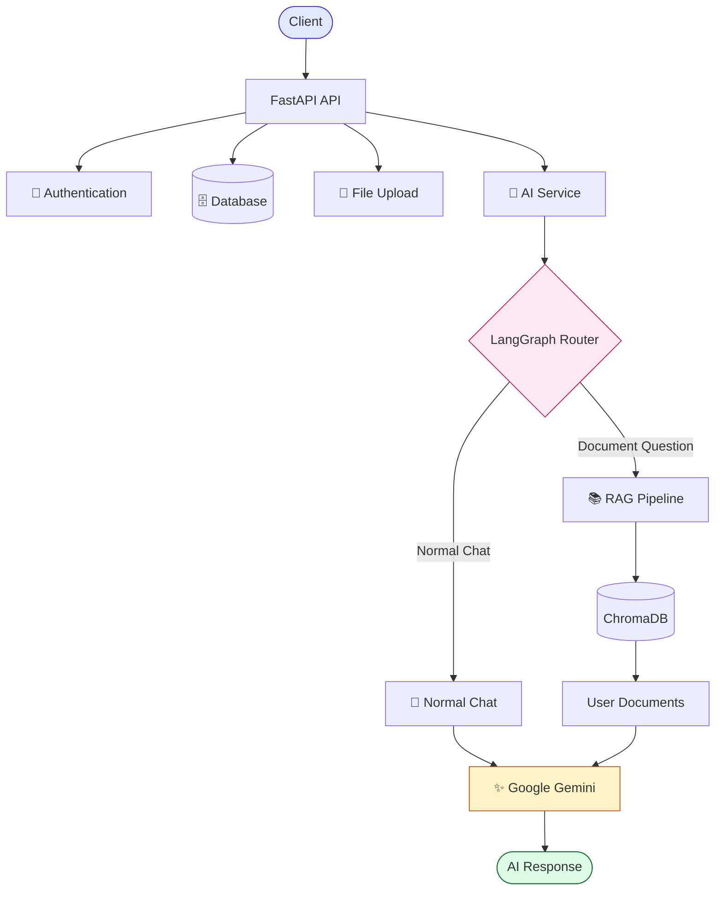
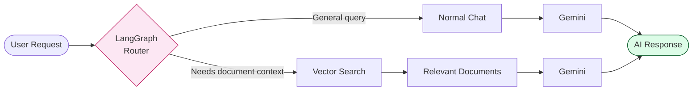
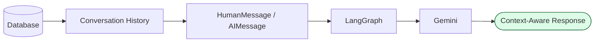
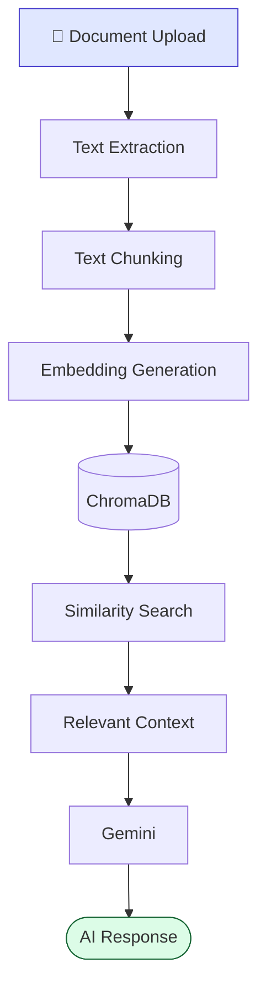

<div align="center">

# 🧠 Enterprise AI Knowledge Platform

**A production-oriented AI-powered knowledge platform** — FastAPI · LangChain · LangGraph · Gemini · RAG

Authenticated users • Persistent conversations • Document ingestion • Semantic search • Streaming AI responses • Caching • Request monitoring

[](https://www.python.org/)
[](https://fastapi.tiangolo.com/)
[](https://www.langchain.com/)
[](https://langchain-ai.github.io/langgraph/)
[](https://ai.google.dev/)
[](https://www.trychroma.com/)
[](https://pytest.org/)
[](#license)

[Features](#-features) • [Architecture](#-architecture) • [Tech Stack](#-tech-stack) • [Getting Started](#-getting-started) • [API](#-api-overview) • [Testing](#-testing)

</div>

---

## 📌 Overview

The **Enterprise AI Knowledge Platform** is a backend system that combines a secure, production-style FastAPI service with an AI layer capable of both normal conversation and **Retrieval-Augmented Generation (RAG)** over user-uploaded documents.

A LangGraph-based router decides — per request — whether to answer from general conversation or to pull context from a user's own documents stored in ChromaDB, before generating a response with Google Gemini. Conversations persist across sessions, responses can be streamed via Server-Sent Events, and every AI request is logged, cached, and monitored.

---

## ✨ Features

<table>
<tr>
<td valign="top" width="50%">

**Backend**
- FastAPI REST API
- SQLAlchemy ORM
- Pydantic validation
- Pagination & filtering
- Global exception handling
- Logging middleware
- CORS configuration
- Background tasks
- File upload support

**Authentication & Authorization**
- Signup / login
- JWT authentication
- Password hashing (Passlib)
- Protected API routes
- Role-based authorization

</td>
<td valign="top" width="50%">

**AI & LLM**
- Google Gemini integration
- LangChain + LangGraph workflow
- Persistent conversation history
- Context-aware responses
- Streaming AI responses (SSE)

**RAG Pipeline**
- Document ingestion & chunking
- Vector embeddings (BAAI/bge-small-en-v1.5)
- ChromaDB semantic search
- User-scoped document filtering
- Automatic chat ↔ RAG routing

**Production Concerns**
- TTL-based response caching
- AI request monitoring & logging
- Centralized AI error handling

</td>
</tr>
</table>

---

## 🏗 Architecture



### AI Request Routing



### Conversation Memory



### RAG Ingestion Pipeline



> Documents are tagged with user metadata, so retrieval is always scoped to the requesting user.

---

## 🧰 Tech Stack

| Category | Technology |
|---|---|
| Backend Framework | FastAPI |
| Language | Python |
| Database | SQLite |
| ORM | SQLAlchemy |
| Validation | Pydantic |
| Authentication | JWT, OAuth2 |
| Password Hashing | Passlib |
| AI Framework | LangChain |
| AI Workflow | LangGraph |
| LLM | Google Gemini |
| Vector Database | ChromaDB |
| Embeddings | BAAI/bge-small-en-v1.5 |
| Testing | Pytest |
| API Server | Uvicorn |

---

## 📂 Project Structure

```text
enterprise-ai-platform/
│
├── app/
│   ├── ai/
│   │   ├── cache.py         # TTL-based response caching
│   │   ├── graph.py         # LangGraph router (chat vs RAG)
│   │   ├── llm.py           # Gemini client wrapper
│   │   ├── monitoring.py    # AI request logging/monitoring
│   │   └── rag.py           # Embedding + retrieval logic
│   │
│   ├── api/
│   │   ├── dependencies.py  # Shared FastAPI dependencies
│   │   └── routes/          # Route definitions
│   │
│   ├── core/
│   │   ├── config.py        # Settings / env management
│   │   ├── logging.py       # Logging configuration
│   │   └── security.py      # JWT + password hashing
│   │
│   ├── db/
│   │   ├── database.py      # DB session/engine setup
│   │   └── init_db.py       # DB initialization
│   │
│   ├── models/               # SQLAlchemy models
│   ├── schemas/               # Pydantic schemas
│   ├── services/               # Business logic layer
│   └── main.py                  # App entrypoint
│
├── tests/
├── uploads/
├── .env
├── .gitignore
├── requirements.txt
└── README.md
```

---

## 🚀 Getting Started

### 1. Clone the repository
```bash
git clone <your-repository-url>
cd enterprise-ai-platform
```

### 2. Create and activate a virtual environment
```bash
python -m venv venv

# Windows
venv\Scripts\activate

# macOS / Linux
source venv/bin/activate
```

### 3. Install dependencies
```bash
pip install -r requirements.txt
```

### 4. Configure environment variables
Create a `.env` file in the project root:
```env
DATABASE_URL=sqlite:///./enterprise.db

SECRET_KEY=your-secret-key
ALGORITHM=HS256
ACCESS_TOKEN_EXPIRE_MINUTES=30

GOOGLE_API_KEY=your-google-api-key
```
> ⚠️ **Never commit your `.env` file to GitHub.**

### 5. Run the application
```bash
python -m uvicorn app.main:app --reload
```

| Resource | URL |
|---|---|
| API base | http://127.0.0.1:8000 |
| Interactive docs (Swagger) | http://127.0.0.1:8000/docs |

---

## 📡 API Overview

| Area | Endpoints provide |
|---|---|
| **Auth** | Registration, login, JWT token generation |
| **Users** | Protected user routes, profile access |
| **Chat** | Conversations, conversation history, streaming AI responses |
| **Documents** | Upload, background ingestion, RAG-based Q&A |

Full interactive documentation (via Swagger UI) is generated automatically at `/docs` once the server is running.

---

## ✅ Testing

```bash
pytest        # run the full suite
pytest -v     # verbose output
```

Covers:
- Authentication flows
- Protected route access control
- AI services (mocked, no live API calls)

---

## 🎯 Key Concepts Demonstrated

REST API design · Backend architecture · Auth & authorization · Database modeling & relationships · JWT security · Background processing · File handling · LangChain & LangGraph · LLM integration · Conversation memory · Retrieval-Augmented Generation · Vector databases & embeddings · Response streaming · Caching · Monitoring · Automated testing

---

## 🔭 Future Improvements

- [ ] Docker containerization
- [ ] Cloud deployment
- [ ] PostgreSQL for production
- [ ] Redis-based caching
- [ ] Asynchronous task queues
- [ ] Advanced observability
- [ ] CI/CD pipeline
- [ ] Multi-model LLM support
- [ ] Enhanced document processing

---

## 👤 Author

**Samarth Gupta**
Built as a production-oriented backend and AI engineering project to explore modern backend systems, LLM applications, RAG pipelines, and AI workflow orchestration.

[GitHub](https://github.com/Samarth041) · [LinkedIn](https://linkedin.com/in/samarth-gupta-097617316)

## 📄 License

This project is currently intended for **educational and portfolio purposes**.
